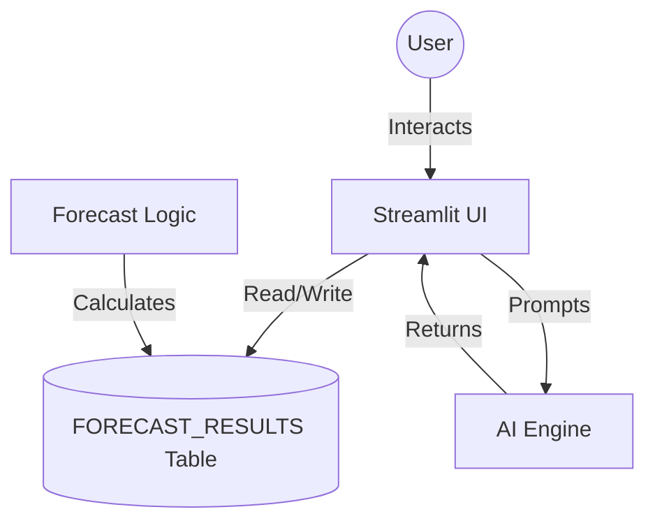

# 📦 AidOps: Rapid Response Logistics Platform
### *An Intelligent Resource Planner for Public Programs*

  

---

## 🚀 Overview
**AidOps** is a Snowflake Native App designed to automate the boring, repetitive parts of logistics: **Forecasting Demand** and **Monitoring Inventory Risks**. 

It replaces manual spreadsheets with an intelligent Command Center that lives directly where your data is—inside the Snowflake Data Cloud.

### 🌟 Key Features
1.  **Zero-ETL Deployment**: Installs inside the database. No AWS/Azure setup required.
2.  **Intelligent Forecasting**: Uses a 7-Day Moving Average algorithm to predict future demand.
3.  **Command Center UI**: A "Glassmorphism" Dashboard built with Streamlit.
4.  **Self-Service Data Manager**: Drag-and-drop CSV upload (no IT tickets needed).
5.  **AI Analyst**: Generates "Plain English" risk reports and drafts restock emails (via Cortex AI).

---

## 🛠️ Technology Stack
*   **Platform**: Snowflake Native App Framework
*   **Language**: Python 3.8 (Snowpark Optimized)
*   **Frontend**: Streamlit
*   **Visualization**: Plotly Express
*   **AI Engine**: Snowflake Cortex (Mistral-Large / Gemma-7b)

---

## 📚 Documentation & Study Guide
This project includes detailed guides for developers and students:
*   [🔌 API & Connectivity Guide](docs/api_connection.md) - How Local vs. Cloud modes work.
*   [🛠️ Technical Deep Dive](docs/technical.md) - Code structure and "Minimal 3.8" dependency strategy.
*   [📚 Study Roadmap](docs/study.md) - What we learned (Snowpark, Security, LLMs).

---

## ⚡ Quick Start

### 1. Installation
The app is packaged as a `deployment script`.
1.  Navigate to the `rapid_relief_app` folder.
2.  Run the installer:
    ```bash
    .\deploy_windows.bat
    ```
3.  Log in to your Snowflake account when prompted.

### 2. Launching the App
1.  Go to **Snowsight** > **Data Products** > **Apps**.
2.  Click **AID_OPS_APP**.
3.  *Note:* You may see a "No Data" screen initially. This is normal.

### 3. Loading Data (The Workflow)
1.  In the Sidebar, go to **Data Manager**.
2.  **Option A (Easy)**: Drag & Drop a CSV file.
3.  **Option B (Advanced)**: Use the SQL Runner tab and paste:
    ```sql
    INSERT INTO CORE.FORECAST_RESULTS (DATE, ITEM_NAME, QUANTITY_USED, FORECAST_NEXT_7_DAYS, STOCK_REMAINING)
    VALUES (CURRENT_DATE(), 'Vaccines', 450, 480.0, 1500);
    ```

---

## 🧪 Architecture


---

## 👨‍💻 Developer Notes
**Running Locally:**
The app supports "Hybrid Mode". You can run it on your laptop for faster dev loops:
```bash
cd rapid_relief_app
streamlit run src/ui_app.py
```
*Requires `.streamlit/secrets.toml` with your credentials.*

---

**License**: MIT  
**Version**: 1.0.0 (Hackathon Release)
